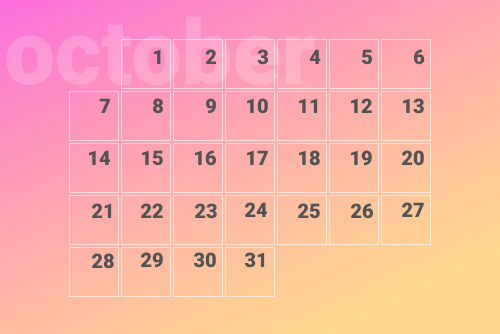

# October

Let's create a calendar for October with flexbox:

* [] add all 31 days for October
* [] there is an offset to the 1st day, since the 1st is a Tuesday

Extra:

* [] add gradient
* [] add semi-transparent decoration text
